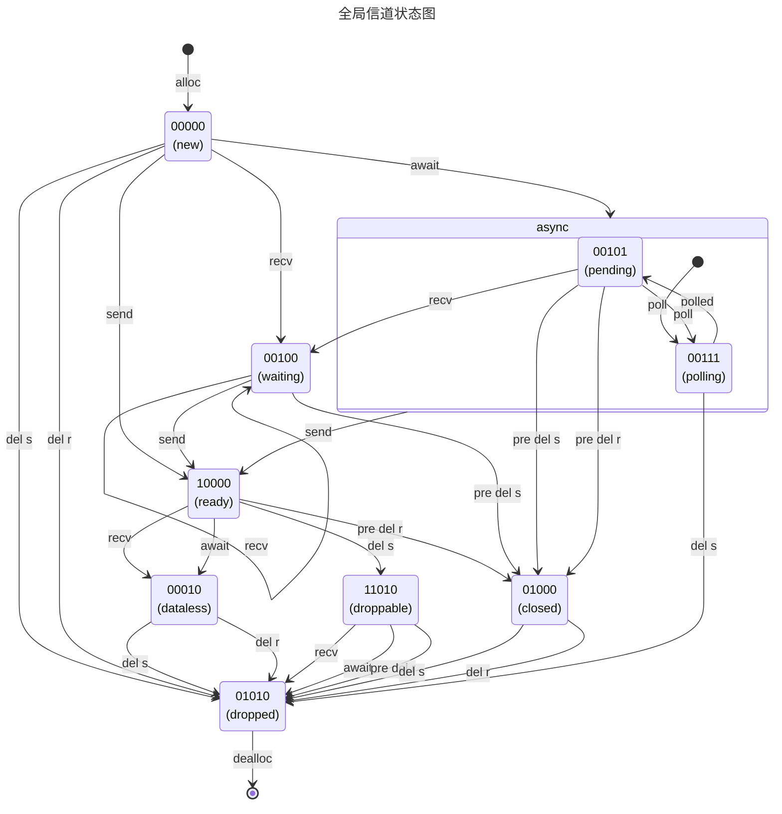

# 可用于同步或异步接收的一次性单值信道实现

> 本文中的bit组合位序使用计算机二进制反序表示：
> low 00000 high

### 原子状态位视图说明

| READY | CLOSE | WAITING | FIELDLESS | PENDING | Sender View | Receiver View |
|:-----:|:-----:|:-------:|:---------:|:-------:|-------------|---------------|
|   0   |   0   |    0    |     0     |    0    | 初始状态，可发送    | 初始状态，需等待      |
|   1   |   0   |    0    |     0     |    0    | 发送完毕可以关闭    | 数据就绪可以读取      |
|   0   |   0   |    1    |     0     |    0    | 可发送、同步唤醒    | 同步等待数据就绪      |
|   0   |   0   |    1    |     0     |    1    | 可发送、异步唤醒    | 异步等待数据就绪      |
|   0   |   0   |    1    |     1     |    1    | 正在设置：唤醒器    | 正在设置：唤醒器      |
|   0   |   0   |    0    |     1     |    0    | 已读取，还未关闭    | 已读取，不可再读      |
|   0   |   1   |    0    |     0     |    0    | 接收关闭、不可发    | 发送关闭、不可读      |
|   0   |   1   |    0    |     1     |    0    | 预备销毁、可回收    | 预备销毁、可回收      |
|   1   |   1   |    0    |     1     |    0    | 发送销毁、已结束    | 发送销毁、可读取      |

### 原子状态位转移表

|      bits      | ==> |      send      |      recv      |     await      |   pre del s    |    dropped     |   pre del r    |    dropped     |
|:--------------:|:---:|:--------------:|:--------------:|:--------------:|:--------------:|:--------------:|:--------------:|:--------------:|
| 00000 初始状态 |  -  | 10000 数据就绪 | 00100 同步等待 | 001X1 异步等待 |   - 无需操作   | 01010 发送销毁 |   - 无需操作   | 01010 接收销毁 |
| 10000 数据就绪 |  -  |       X        | 00010 数据已读 | 00010 数据已读 |   - 无需操作   | 11010 发送销毁 | 01000 清理关闭 | 01010 接收销毁 |
| 00100 同步等待 |  -  | 10000 就绪唤醒 |   - 重复等待   |       X        | 01000 关闭唤醒 | 01010 发送销毁 |       X        |       X        |
| 00111 异步轮询 |  -  | 10000 强制就绪 |       X        | 00101 异步等待 |   - 无需操作   | 01010 强制销毁 |       X        |       X        |
| 00101 异步等待 |  -  | 10000 就绪唤醒 | 00100 强制同步 | 00111 重复轮询 | 01000 关闭唤醒 | 01010 发送销毁 | 01000 关闭唤醒 | 01010 接收销毁 |
| 01000 通道关闭 |  -  |  Err 禁止发送  | None 无可读取  | None 无可读取  |   - 无需操作   | 01010 发送销毁 |   - 无需操作   | 01010 接收销毁 |
| 01010 预备销毁 |  -  |  Err 禁止发送  | None 无可读取  | None 无可读取  |   - 无需操作   |   - 内存回收   |   - 无需操作   |   - 内存回收   |
| 00010 数据已读 |  -  |       X        | None 无可读取  | None 无可读取  |   - 无需操作   | 01010 发送销毁 |   - 无需操作   | 01010 接收销毁 |
| 11010 就绪销毁 |  -  |       X        | 01010 已读关闭 | 01010 已读关闭 |       X        |       X        | 01010 清理销毁 |   - 内存回收   |

### 原子状态位转换流程图

